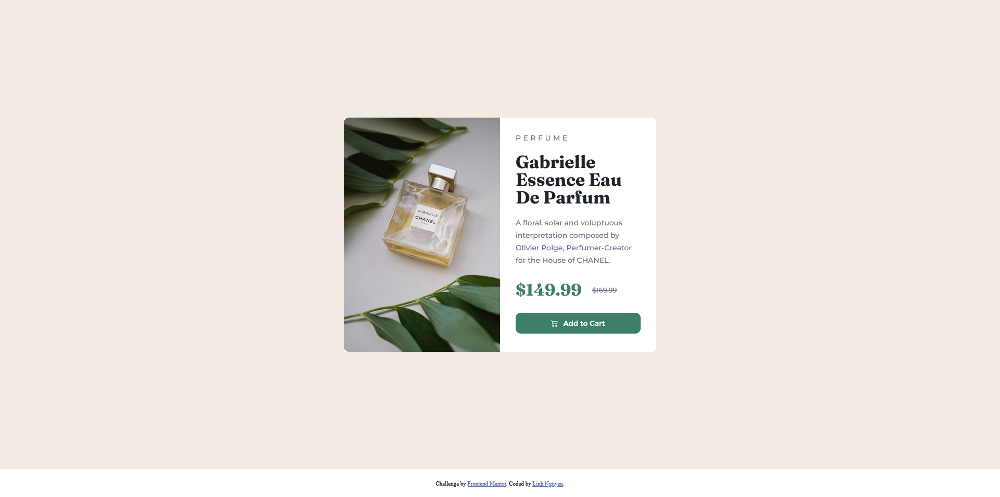

# Frontend Mentor - Product preview card component solution

## Table of contents

- [Overview](#overview)
  - [The challenge](#the-challenge)
  - [Screenshot](#screenshot)
  - [Links](#links)
- [My process](#my-process)
  - [Built with](#built-with)
  - [What I learned](#what-i-learned)
  - [Continued development](#continued-development)
  - [Useful resources](#useful-resources)
- [Author](#author)

## Overview

### The challenge

Users should be able to:

- View the optimal layout depending on their device's screen size
- See hover and focus states for interactive elements

### Screenshot

_1. Desktop design_

_2. Mobile design_

### Links

<!-- - Solution URL: [Add solution URL here](https://your-solution-url.com) -->
- Live Site URL: [Product preview card page](https://auri222.github.io/Product-preview-card-HTML-CSS/)

## My process

### Built with

- Semantic HTML5 markup
- CSS custom properties
- Flexbox
- CSS Grid
- [Bootstrap Icons](https://icons.getbootstrap.com/)

### What I learned

- Using a basic grid structure
- Building a responsive web with media queries (desktop first)

### Continued development

- Building a responsive web with media queries with the approach of mobile-first.

### Useful resources

- [MDN Web Docs](https://developer.mozilla.org/en-US/) - This helped me how to use border radius, line-height, text-transform and grid.
- [Responsive Web Design - Media Queries from W3Schools](https://www.w3schools.com/css/css_rwd_mediaqueries.asp) - This is an amazing article which helped me understand how to build a responsive website using media queries.
- [The Joy of CSS Grid - Build 3 Beautifully Simple Responsive Layouts from Fireship's Youtube channel](https://www.youtube.com/watch?v=705XCEruZFs&t=551s) - This video helped me a lot on how to use basic grid.

## Author

- Frontend Mentor - [@auri222](https://www.frontendmentor.io/profile/auri222)
